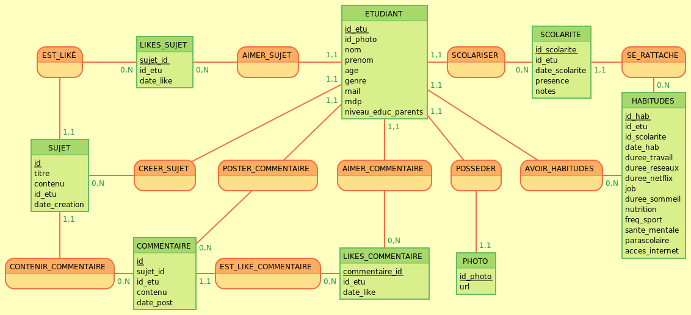

# Orga+ : L'équilibre et la performance au bout des doigts

**Orga+** est une plateforme web conçue par et pour les étudiants. Face à la surcharge mentale et aux distractions numériques, Orga+ propose une approche globale : transformer la prise de conscience en leviers d'action concrets pour améliorer le bien-être et les résultats académiques.

---

## Le Concept

Le constat est simple : les outils classiques (to-do lists) sont souvent trop isolés. **Orga+** se distingue par une vision à 360° :
* **Auto-diagnostic :** Analyse des habitudes de vie (sommeil, job, réseaux sociaux, Netflix).
* **Visualisation :** Transformation des données en graphiques parlants.
* **Simulation :** Utilisation de l'intelligence statistique pour prédire l'impact de vos changements.
* **Bienveillance :** Un accompagnement progressif sans culpabilisation.

---

## Fonctionnalités Clés

### Tableau de Bord & Analyse
Suivez votre évolution grâce à des graphiques dynamiques. Visualisez comment la réduction de votre temps d'écran ou l'optimisation de votre sommeil influence votre courbe de motivation.

### Simulateur de Performance
Basé sur un modèle de **régression linéaire** entraîné sur un dataset Kaggle de 400 profils, ce simulateur vous permet de tester des scénarios :
> *"Et si je travaillais 1h de plus par jour et dormais 30 min de plus, quel serait l'impact sur ma moyenne ?"*

### Forum d'Entraide
Un espace communautaire pour échanger des astuces, poser des questions sur l'orientation ou partager ses méthodes d'organisation.

---

## Architecture

| Secteur | Technologies |
| :--- | :--- |
| **Frontend** | HTML5, CSS3, JavaScript (Interactivité & Sliders) |
| **Backend** | PHP (Gestion des sessions & logique métier) |
| **Base de données** | MySQL / PhpMyAdmin |
| **Analyse de données** | RStudio (Calcul des coefficients de régression) |
| **Design** | Figma (Prototypage UI/UX) |

---

## Gestion de Projet (Méthode Agile)

Notre démarche a été structurée pour répondre aux besoins réels des utilisateurs :

1.  **Personas :**
    * **Romain (Primaire) :** Étudiant en informatique cherchant à retrouver de la discipline.
    * **Anne (Secondaire) :** Mère de famille souhaitant accompagner ses enfants.
    * **Pierre (Anti-persona) :** Profil déjà très organisé (hors cible).
3.  **StoryMap :** Découpage en *User Stories* pour prioriser le développement des fonctionnalités essentielles (MVP).
4.  **Architecture des données :** Conception d'un MCD évolutif pour gérer les interactions complexes du forum et le suivi des habitudes.

---

## Modélisation des données

Nous avons itéré sur notre modèle de données pour garantir fluidité et sécurité.

### Modèle Conceptuel de Données (MCD)

### Base de données   

Nous utilisons un jeu de données issu de [Kaggle](https://www.kaggle.com/datasets/adilshamim8/education-and-career-success) comprenant 18 variables (Score SAT, genre, stages, etc.) pour nourrir nos algorithmes de comparaison et de simulation.

---

## Sécurité & Performance

* **Protection SQL :** Utilisation systématique de requêtes préparées pour contrer les injections.
* **Sécurité XSS :** Filtrage rigoureux des entrées sur le forum.
* **RGPD & Vie Privée :** Hachage des mots de passe et sécurisation des données personnelles.
* **Serveur :** Configuration pour résister aux comportements malveillants et filtrage des erreurs.

---

## Installation
